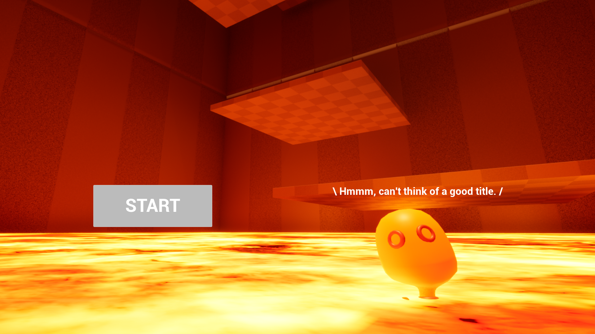
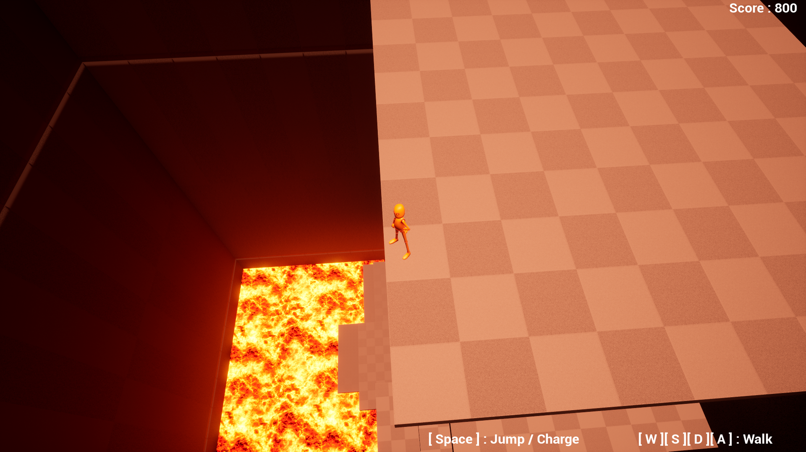

## 概要

- UnrealEngineで作成した3Dゲーム

## デモ

### タイトル

### プレイ画面

- 下方から死が迫ってくるのでランダムで生成される床に飛び乗って逃げる
- ステージには区切りがあり、そのラインを超えたときにスコアが加算されていく

- ジャンプにはチャージがあり、十分な溜めがないと次のフロアに届かない

## ドキュメント

- [ソース概説](./Document/Source/about.md)
- [UnrealEngineまとめ](./Document/UnrealEngine/index.md)
  - 今回勉強した内容の備忘録
  - 閲覧する際は[Obsidian](https://obsidian.md/)のインストール推奨

## 環境

- 参考まで
- 個人で動作確認した環境

| 項目 | 動作環境 |
| --- | --- |
| CPU | Intel Core i5-12400F |
| OS | Windoews 11 |
| メモリ | 32GB |
| グラフィックスカード | NVIDIA GeForce RTX 3060 |

### 開発用ソフトウェア

- UnrealEngine5.2